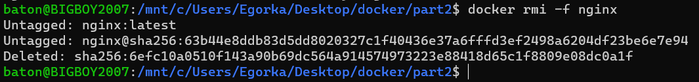
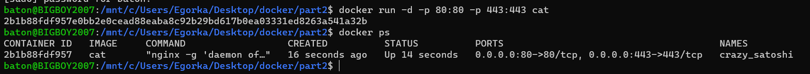
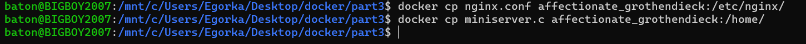

## Part1. Готовый докер

#### С помощью команды `docker pull nginx` запулим образ докер

#### Проверим наличие докера через `docker images`

#### Запустим контейнер через `docker run -d [image_id|reposixtory]`

#### Проверим что образ запустился(через `docker ps`)

#### Посмотрим информацию о контейнере через `docker inspect [image_id|container_name]`

#### Посмотрим размер контейнера

#### Посмотрим список замапленных портов

#### Посмотрим ip контейнера

#### Остановим работу контейнера(через docker stop [container_id|container_name])

#### Проверим, что образ остановился(через docker ps)

#### Запустим докер с портами 80 и 443 через команду `run` и проверим его работоспособность через `docker ps`

#### Перезапустим докер через команду `docker restart [container_id|container_name]` и проверим его работоспособность через `docker ps`

#### Стартовая страница nginx по адресу localhost:80

## Part 2. Операции с контейнерами 

#### Откроем конфигурационный файл nginx.conf в докере(используя `docker exec`)

#### Создаем на локальной машине файл nginx.conf

#### Настроим в нем по пути */status/* отдачу страницы статуса сервера **nginx**

##### P.S. Пришлось закоментить строку *include /etc/nginx/conf.d/.conf* потому, что в противном случае страница */status/* не отображалась

#### Скопируем *nginx.conf*  внутрь докера командой `docker cp`

#### 	Перезапустим **nginx** внутри докер образа через команду `docker exec`

#### Проверим, что по адресу [localhost:80/status/](localhost:80/status/) отдаётся страничка со статусом сервера **nginx**

#### Экспортировать контейнер в файл *container.tar* через команду `docker export`

#### Отключим *docker* командой `docker stop`

#### Удаляем образ командой `docker rmi` 

#### Удаляем контейнер командой `docker rm`

#### Импортируем контейнер обратно используя команду `docker import`

#### Запустим контейнер командой `docker run`

#### Проверим, что по адресу [localhost:80/status/](localhost:80/status/) отдаётся страница со статусом сервера **nginx**

## Part  3. Мини веб-сервер

####  Напишем  мини сервер на C и FastCgi, который будет возвращать страницу с надписью *Hello World!*

#### Напишем свой *nginx.conf*, который будет перенаправлять все запросы с 81 порта на 127.0.0.8080

#### Запустим написанный мини сервер через spawn-fcgi на порту 8080

- ##### Сначала запулим образ **nginx**

  

- ##### Запустим контейнер

  

- ##### Скопируем *nginx.conf* и *miniserver.c* в контейнер

  

- ##### Подключимся к контейнеру и установим нужные пакеты

  
  
  
  
  

- ##### Запустим сервер

  

#### Проверим, что в браузере по [localhost:81](localhost:81) возвращается страница написанная нами

## Part 4. Свой докер

#### Создаём докерфайл

#### Создадим скрипт, выполняющий роль *entrypoint*

#### Соберём образ через `docker build` при этом указав имя

#### Проверим через `docker images`, что всё собралось как надо

#### Запустим собранный докер с маппингом 81 порта на 80 порт на локальной машине и маппингом папки *./nginx* внутрь контейнера по адресу, где лежат конфигурационные файлы

#### 

#### Проверим что всё успешно работает пройдя по странице [localhost:81](localhost:81)

#### Выключим контейнер и допишем в *nginx.conf* проксирование странички ***/status***, по которой мы будем отдавать статус nginx

#### Снова запустим сервер и заглядываем в браузер

## Part 5. Dockle

#### Сначала установим **Dockle**

#### Проверим образ

#### После исправлений получилось это

## Part 6. Базовый Docker Compose

#### Для начала напишем(перепишем) скрипт для *entrypoint*, чтобы второй контейнер не завершал работу после `docker-compose up`

#### Перепишем *nginx.conf* для проксирования

#### Напишем простой *docker-compose.yml*

#### Билдим всё это командой `docker-compose build`

#### Запускаем контейнеры командой `docker-compose up`

#### Смотрим странички в браузере

