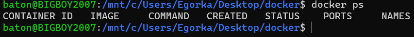

## Part1. Готовый докер

#### С помощью команды `docker pull nginx` запулим образ докер

#### Проверим наличие докера через `docker images`

#### Запустим контейнер через `docker run -d [image_id|reposixtory]`

#### Проверим что образ запустился(через `docker ps`)

#### Посмотрим информацию о контейнере через `docker inspect [image_id|container_name]`

#### Посмотрим размер контейнера

#### Посмотрим список замапленных портов

#### Посмотрим ip контейнера

#### Остановим работу контейнера(через docker stop [container_id|container_name])

#### Проверим, что образ остановился(через docker ps)

#### Запустим докер с портами 80 и 443 через команду `run` и проверим его работоспособность через `docker ps`

#### Перезапустим докер через команду `docker restart [container_id|container_name]` и проверим его работоспособность через `docker ps`

#### Стартовая страница nginx по адресу localhost:80

## Part 2. Операции с контейнерами 

#### Откроем конфигурационный файл nginx.conf в докере(используя `docker exec`)

#### Создаем на локальной машине файл nginx.conf

#### Настроим в нем по пути */status/* отдачу страницы статуса сервера **nginx**

##### P.S. Пришлось закоментить строку *include /etc/nginx/conf.d/.conf* потому, что в противном случае страница */status/* не отображалась

#### Скопируем *nginx.conf*  внутрь докера командой `docker cp`

#### 	Перезапустим **nginx** внутри докер образа через команду `docker exec`

#### Проверим, что по адресу [localhost:80/status/](localhost:80/status/) отдаётся страничка со статусом сервера **nginx**

#### Экспортировать контейнер в файл *container.tar* через команду `docker export`

#### Отключим *docker* командой `docker stop`

#### Удаляем образ командой `docker rmi` 

## Part  3. Мини веб-сервер

## Part 4. Свой докер

## Part 5. Dockle

## Part 6. Базовый Docker Compose
